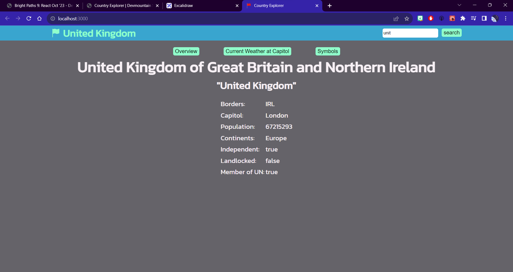

This project was created to help demonstrate how to use react-redux in a react application.

# React Unit 5: Country Explorer

## Project Overview

This repository contains my Unit 5 project for the Bright Paths Program. The project focuses on building a Country Explorer web application using React and Redux. The Country Explorer allows users to browse information about different countries, including details about their capitals, populations, borders, and more.



## Key Features

- View a list of potential countries to explore.
- Select a country from the list to display detailed information.
- Check the current weather in the capital of the selected country.
- View the country's flag and coat of arms.

## Technologies Used

- React: A JavaScript library for building user interfaces.
- Redux: A state management library for managing application state.
- Axios: A JavaScript library for making HTTP requests to APIs.
- RapidAPI: Used for fetching real-time weather data.
- CSS: Styling the components for a user-friendly interface.

## Getting Started

To run this project locally, follow these steps:

1. Clone this repository to your local machine:

   ```bash
   git clone https://github.com/ngrifk98/react-unit-5-country-explorer.git
   ```

2. Navigate to the project directory:

   ```bash
   cd react-unit-5-country-explorer
   ```

3. Install the project dependencies:

   ```bash
   npm install
   ```

4. Start the development server:

   ```bash
   npm start
   ```

5. Open your web browser and access the application at [http://localhost:3000](http://localhost:3000).

## Usage

- Select a country from the list on the left to view detailed information.
- Click on different tabs to explore various aspects of the selected country, including overview, weather, and symbols.

## Project Structure

The project is organized into the following components:

- **Header**: Displays the current country being viewed and provides a search feature.
- **OptionDisplay**: Lists potential countries to explore.
- **MainDisplay**: Displays detailed information about the selected country and provides tabs for different views (overview, weather, symbols).
- **Overview**: Shows general information about the selected country.
- **Weather**: Displays current weather information for the country's capital.
- **Symbols**: Shows the country's flag and coat of arms.

## Contributing

Contributions to this project are welcome! If you'd like to contribute, please follow these steps:

1. Fork the repository.
2. Create a new branch for your feature or bug fix: `git checkout -b feature-name`
3. Make your changes and commit them: `git commit -m 'Add some feature'`
4. Push your changes to your forked repository: `git push origin feature-name`
5. Create a pull request to the main repository.

## License

This project is licensed under the MIT License. See the [LICENSE](LICENSE) file for details.

## Acknowledgments

- Thanks to the Bright Paths Program for providing the opportunity to work on this project.
- Special thanks to the instructors and mentors for their guidance and support.

Enjoy exploring countries with Country Explorer!
